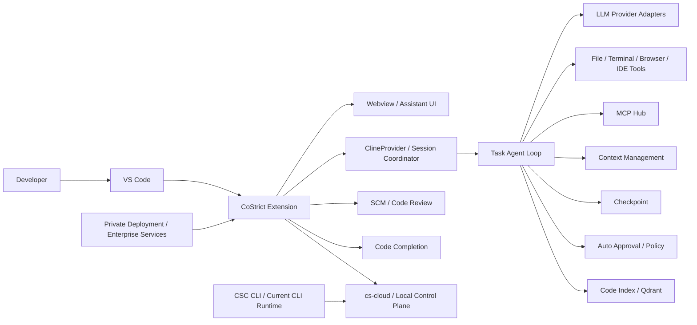
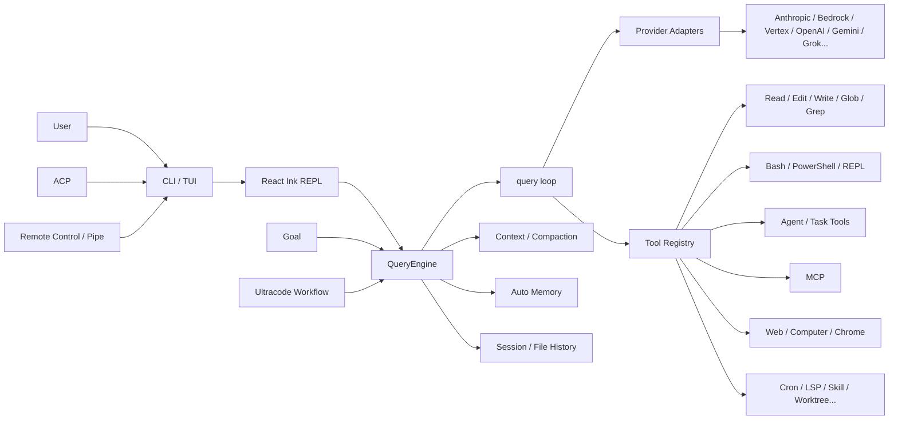

# CoStrict vs Claude Code Best 技术对比与评估报告

> **评估日期：2026-09-17**  
> **评估对象：**
> - CoStrict：https://github.com/zgsm-ai/costrict
> - Claude Code Best：https://github.com/claude-code-best/claude-code
>
> **说明：** 本报告基于两项目截至评估日期可见的主分支源码、仓库文档、官方产品文档与配置进行静态技术评估。  
> 本报告**不是**统一硬件、统一模型、统一任务集下的运行时 Benchmark，也**不是**安全审计或法律意见。涉及性能、成本和安全性的结论，会明确区分“源码/文档证据”和“架构推断”。

---

## 1. 执行摘要

CoStrict 与 Claude Code Best（下文简称 **CCB**）表面上都属于“AI Coding Agent”，但它们真正解决的问题并不完全相同：

- **CoStrict 更像一个面向企业研发流程的 AI Coding Platform**。主仓库的中心形态是 **VS Code Extension + Webview + Agent Task Runtime**，明显继承 Roo Code / Cline 系谱；在此基础上增加了代码索引、Qdrant、SCM Code Review、代码补全、Strict Mode/StrictPlan、企业私有化、Cloud UI，以及当前独立演进的 CSC CLI。
- **CCB 更像一个 Claude Code 兼容的 Terminal Agent Runtime / Agent Shell**。核心围绕 CLI/TUI、Query Engine、Tool Registry、权限与 OS Sandbox、多 Agent、Goal、Ultracode、ACP、Remote Control、Pipe、Computer/Chrome Use 等能力展开，强调自动化、终端工作流和 Claude Code 生态兼容。

一句话概括：

> **CoStrict 的核心价值是“把 Agent 嵌入企业研发流程”；CCB 的核心价值是“把 Claude Code 风格的 Agent Runtime 做得更开放、更可编排”。**

如果企业重点是：

- VS Code 原生体验；
- SCM 内 Code Review；
- 大仓库代码语义索引；
- 需求 → 计划 → 编码 → Review/Test 的标准化流程；
- 私有部署与企业管控；

则 **CoStrict 更匹配**。

如果重点是：

- Terminal-first；
- Claude Code 工作方式兼容；
- 强大的 Headless/自动化能力；
- 高度自由的多 Agent 编排；
- ACP / Remote Control / Pipe / Computer Use 等外围能力；
- 将 Coding Agent 当作一个可编程运行时进行研究或二次实验；

则 **CCB 更匹配**。

但是在企业商用场景中，两者存在完全不同的风险：

1. **CoStrict 主仓库 Apache-2.0，许可边界相对清晰；但其增量/全量 Code Review 子系统官方明确为闭源商业组件。**
2. **CCB 在本次仓库快照中没有看到标准开源 LICENSE 文件，README 明确写有“仅供学习研究用途，Claude Code 的所有权利归 Anthropic 所有”；同时仓库自己的 `AGENTS.md` 将项目描述为 reverse-engineered / decompiled Claude Code。**  
   因此，如果准备将 CCB 用作企业商业产品基础，**许可、知识产权和代码来源审查应当先于技术 PoC**。

---

# 2. 评估方法

本报告重点抽查了以下层次，而不是只比较 README：

1. **产品定位与主入口**
2. **Monorepo / 构建体系**
3. **Agent 主循环**
4. **模型 Provider 抽象**
5. **Tool Registry / Tool Calling**
6. **上下文管理**
7. **跨会话 Memory**
8. **代码检索 / RAG**
9. **多 Agent 与 Workflow**
10. **MCP / Skill / Plugin**
11. **权限模型**
12. **Shell Sandbox**
13. **IDE / CLI / Remote 能力**
14. **Checkpoint / Session 恢复**
15. **测试与工程质量**
16. **源代码谱系与维护成本**
17. **部署与企业化**
18. **开源边界与商用风险**

证据优先级如下：

> 源码 / package 配置 > 项目内部开发文档 > 官方产品文档 > README > 架构推断

---

# 3. 项目快照

| 项目 | CoStrict | Claude Code Best |
|---|---|---|
| GitHub | `zgsm-ai/costrict` | `claude-code-best/claude-code` |
| 主要形态 | VS Code Extension + Webview + CSC CLI/Cloud/企业服务 | CLI/TUI + Agent Runtime |
| 主要语言 | TypeScript | TypeScript |
| Runtime / Toolchain | Node.js + pnpm + Turbo | Bun + Workspaces + Biome |
| 主仓库版本线索 | VS Code Extension `3.0.21` | CCB `2.1.x` 系列；内部文档存在独立版本记录 |
| Agent 血缘 | Roo Code / Cline 系谱明显 | Claude Code reverse-engineered / restored |
| MCP | 支持 | 支持 |
| Subagent | 支持 | 支持 |
| Skills | 支持 | 支持 |
| IDE 原生集成 | 强 | 中等，主要依赖 ACP / 外部 IDE |
| CLI 自动化 | 强，但属于当前独立演进的一条产品线 | 很强，项目核心 |
| 代码向量索引 | 有，Qdrant | 未发现同等级一等公民式持久代码向量库 |
| OS 级 Shell Sandbox | 主 VS Code 插件抽检路径中未确认统一等价层；CSC 另有权限/隔离体系 | 明确集成 `@anthropic-ai/sandbox-runtime` |
| 企业私有化 | 一等能力 | 有自托管/Remote 能力，但企业治理不是唯一中心 |
| 主仓库许可 | Apache-2.0 | 本次快照未观察到标准 LICENSE；README 写“仅供学习研究” |
| 重要闭源边界 | 增量/全量 Code Review 子系统 | 不适用，但整体许可清晰度偏低 |
| GitHub 热度快照 | 约 4.4k stars / 201 forks | 约 22.6k stars / 16.5k forks |
| 历史提交量快照 | 约 6.5k commits | 约 834 commits |

> 注：Star、Fork、Commit 数只能表示社区传播和历史规模，**不能直接等价于代码质量或产品成熟度**。CoStrict 的提交历史也包含明显的上游继承因素。

---

# 4. 最核心的架构差异

## 4.1 CoStrict：IDE 平台型架构

从主仓库目录和依赖可以看到：

- `src/`：VS Code Extension 主体；
- `webview-ui/`：Webview 前端；
- `packages/core`：平台无关核心能力；
- `apps/`、`packages/`：Monorepo；
- `@roo-code/core`、`@roo-code/types`、`@roo-code/cloud`、`@roo-code/ipc` 等依赖/工作区；
- 源码中仍可见 `ClineProvider`、`Task` 等典型 Roo/Cline 命名；
- `@qdrant/js-client-rest` 用于代码索引能力；
- MCP SDK；
- 多 Provider SDK；
- Cloud UI / Assistant UI；
- SCM Review；
- Completion；
- Strict Mode。

主路径可抽象为：



这个结构说明 CoStrict 的竞争点不是简单“Agent 能不能编辑文件”，而是：

> **Agent + IDE + 代码理解 + 研发流程 + 企业服务。**

---

## 4.2 CCB：Agent Runtime / Terminal Shell 型架构

CCB 的源码中心更接近：



其设计重心是：

- 让模型通过工具持续循环；
- 管理 Session；
- 管理权限；
- 在 Terminal 中长时间执行任务；
- 让多个 Agent / 工作流相互协作；
- 对接不同模型和不同前端。

因此，CCB 更像一个：

> **面向 Coding Agent 的可编程操作系统/运行时外壳。**

---

# 5. 一个非常重要的 CoStrict 架构事实：它不是单一血缘 Runtime

理解 CoStrict 时最容易犯的错误是：

> 把整个 CoStrict 看作“一个 Roo/Cline Fork”。

这样会漏掉它当前产品架构中的第二条重要路线。

## 5.1 主仓库：Roo/Cline 系谱

主仓库中可以看到非常明确的历史痕迹：

- `@roo-code/*`
- `ClineProvider`
- `Task`
- `.roo`
- `.roomodes`
- `sync-upstream.md`

这说明它的 **VS Code Agent 主体**与 Roo/Cline 有很深的架构继承关系。

优势：

- 直接继承了成熟的 IDE Agent 交互范式；
- 工具调用、Diff、Terminal、Task、历史、上下文等基础能力不是从零开始；
- VS Code 使用体验成熟。

风险：

- 需要长期处理与上游演进之间的差异；
- 存在大量历史命名和兼容层；
- 自有企业功能越多，未来同步上游的成本越高。

---

## 5.2 当前 CSC CLI：独立演进

CoStrict 当前官方 CLI 文档使用 `csc`，并提供：

- `--agent`
- `--agents`
- `--allowedTools`
- `--disallowedTools`
- `--permission-mode`
- `--add-dir`
- `--bare`
- Subagent
- Worktree isolation
- Skills
- Plugins
- MCP
- Hooks
- Auto Memory
- Agent Teams 等能力。

同时，CoStrict 生态中还存在一个 OpenCode 衍生仓库：

`zgsm-sangfor/opencode`

该仓库明确描述自己为：

> “The open source AI coding agent based on opencode with costrict-specific optimizations.”

而 VS Code 主仓库当前又包含：

- `costrict.csCloudBaseUrl`
- 默认本地 `127.0.0.1`
- `csc` / `cs`
- OpenCode-compatible `cs-cloud API`

等配置。

因此更准确的判断是：

> **CoStrict 当前是一个正在融合多条 Agent 技术路线的产品平台，而不是只有一套 Runtime。**

### 对企业意味着什么？

这是双刃剑。

**好处：**

- IDE、CLI、Cloud、Code Review 可以分别选择最适合的技术路线；
- 产品能力扩张速度快；
- 不受单一上游约束。

**代价：**

- Session、权限、Agent 定义、Tool 语义可能需要跨 Runtime 对齐；
- 维护和测试矩阵变大；
- IDE Runtime 与 CLI Runtime 的行为一致性成为工程挑战；
- 新旧配置兼容可能累积技术债。

这一点是本报告认为 CoStrict 最值得持续观察的架构问题之一。

---

# 6. Agent 主循环对比

## 6.1 CoStrict

主仓库 `Task.ts` 是核心 Agent Runtime 之一。

抽查可见它涉及：

- Task 状态；
- API Streaming；
- 工具调用；
- Tool repetition detection；
- Context management；
- Checkpoint；
- Auto Approval；
- Model fallback；
- 消息队列；
- 异常 Tool Call 处理；
- API conversation history。

外围由 `ClineProvider` 负责：

- Provider / Session 级生命周期；
- Task stack；
- Webview；
- MCP；
- Code Index；
- Skills；
- 配置和持久化。

这种设计属于典型的：

> **Provider 管 Session，Task 管一次 Agent 生命周期。**

### 优势

- Agent 与 IDE 状态结合很紧；
- Diff、Terminal、文件操作、UI、上下文、Checkpoint 能统一管理；
- 适合交互式 Coding。

### 缺点

- `Task` 容易成为“大类”；
- IDE State、Agent State、Tool State 之间耦合较多；
- 如果再与新的 CSC Runtime 并存，需要解决两套循环的语义差异。

---

## 6.2 CCB

CCB 的核心结构更容易抽象为：

```text
CLI/TUI
  ↓
QueryEngine
  ↓
query()
  ↓
stream model
  ↓
tool_use
  ↓
permission
  ↓
tool execution
  ↓
tool_result
  ↓
next model turn
```

其中：

- `QueryEngine` 更偏向 Conversation State / Compaction / File History / Turn bookkeeping；
- `query()` 更偏向实际 Agent Turn Loop；
- Tool Registry 负责工具实现和注册。

### 优势

职责比传统 Cline 式大 Task 类更容易拆解：

- 会话状态；
- 模型流；
- Tool；
- UI；
- Provider；

相对独立。

此外，它的 Goal / Ultracode 又是在 Query Engine 之上继续增加一个“更高层 Agent Driver”。

因此 CCB 是明显的：

> **Agent Loop + Meta-Orchestration 两层设计。**

### 缺点

功能膨胀也非常明显：

- `main.tsx` 规模很大；
- CLI subcommand 非常多；
- Runtime 同时承担 Shell、Web、Remote、ACP、Computer Use、Plugins 等大量能力。

因此它虽然模块多，但不是“小而美”的 Agent Runtime。

---

# 7. 上下文管理与 Memory

这是两个项目差异最大的部分之一。

---

## 7.1 CoStrict：更强调代码库语义上下文

CoStrict 主仓库包含：

- Code Index Manager；
- Qdrant client；
- embedding batch；
- 文件索引数量配置；
- Repo-wide Code Review；
- Task-level context management。

VS Code 设置中能看到：

- `maximumIndexedFilesForFileSearch`
- 默认 10,000；
- 最大可配置到 500,000；
- `codeIndex.embeddingBatchSize`
- 默认 60。

说明 CoStrict 把：

> **大型代码库的持久语义索引**

当作重要的一等能力。

这对以下任务特别重要：

- 跨几十/几百模块分析；
- 大型 Monorepo；
- Architecture Review；
- Security Review；
- “这个接口被整个仓库哪些路径依赖？”；
- 企业历史代码理解。

---

## 7.2 CCB：更强调透明的文本 Memory + Context Engineering

CCB 的 Project Memory 采用文件体系：

```text
~/.claude/projects/<git-root>/memory/
├── MEMORY.md
├── ...
└── logs/
```

设计特点包括：

- `MEMORY.md` 作为索引；
- Memory 类型化；
- 长度限制；
- 使用轻量模型选择与当前任务相关的若干 Memory 文件；
- 与 `CLAUDE.md`、项目上下文、Git 状态共同进入 Context；
- `QueryEngine` 负责 Context Compaction。

这是一种非常不同的哲学：

> **Memory 首先应该可读、可审查、可版本化，而不是必须进入向量数据库。**

### 优点

- 透明；
- 调试方便；
- 用户容易修改；
- 不依赖向量 DB；
- 对“跨会话偏好 / 项目经验 / 决策记录”很有效。

### 缺点

它并不天然替代：

> 大规模代码库的向量语义检索。

CCB 可以通过：

- Grep
- Glob
- LSP
- Explore Agent
- Subagent
- Worktree

来探索代码，但这与持久化 Qdrant 代码索引仍是两种方案。

---

## 7.3 本项结论

| 场景 | 更匹配 |
|---|---|
| Repo-wide semantic code retrieval | **CoStrict** |
| 超大仓库 Code Review | **CoStrict** |
| 轻量跨会话记忆 | **CCB** |
| Memory 可读性 / 可审计性 | **CCB** |
| 无数据库部署 | **CCB** |
| 企业级持久代码知识索引 | **CoStrict** |

---

# 8. 多 Agent 与 Workflow

## 8.1 CoStrict：流程型 Multi-Agent

CoStrict 的 StrictPlan 官方流程大致是：

```text
需求输入
   ↓
需求分析
   ↓
项目探索
   ↓
需求澄清
   ↓
Plan / Proposal
   ↓
用户确认
   ↓
任务拆分
   ↓
SubCodingAgents
   ↓
实现
   ↓
ReviewAndFix / Test
```

这里的关键不是“有几个 Agent”，而是：

> **多 Agent 被嵌入了一套软件工程流程。**

因此 CoStrict 强项是：

- 强约束；
- 阶段划分；
- 人工 Gate；
- Review；
- 测试；
- 企业 SOP；
- 审计可解释。

当前 CSC 自定义 Subagent 还支持：

- Tool allowlist；
- Tool denylist；
- Model；
- Permission mode；
- MCP；
- Hook；
- Max turns；
- Skills；
- Memory；
- Worktree isolation；
- 允许限制 Agent 可继续调用哪些 Agent。

这是比较完整的 Subagent 管理系统。

---

## 8.2 CCB：编排型 Multi-Agent

CCB 除了 Agent / Task 工具之外，还提供：

### Goal

`/goal` 面向跨 Turn 的持续任务：

- 持续执行直到目标完成；
- Token budget；
- completion 判断；
- blocked audit；
- pause/resume。

### Ultracode

提供确定性的 JavaScript Workflow Tool：

- `agent`
- `pipeline`
- `parallel`
- `phase`

并包含：

- 并发控制；
- Token budget；
- Journal；
- replay；
- workflow monitoring。

这意味着 CCB 不只是“模型决定什么时候开 Subagent”，而是允许：

> **代码显式控制 Agent 拓扑。**

这是一个非常重要的架构优势。

---

## 8.3 本项结论

如果要：

### “让研发流程规范化”

CoStrict 更合适：

> requirement → architecture → tasks → implementation → review/test

如果要：

### “把多个 Agent 当作编程原语”

CCB 更灵活：

> parallel / pipeline / phase / agent

因此：

- **CoStrict = Software Engineering Workflow**
- **CCB = Agent Orchestration Runtime**

---

# 9. Tool 系统与扩展能力

## 9.1 CoStrict

核心扩展方式：

- 内置 IDE / File / Terminal 工具；
- MCP；
- Skills；
- Modes；
- CSC Subagents；
- Hooks；
- Plugins；
- Agent；
- SCM；
- Code Index；
- Completion。

MCP Client 支持：

- stdio；
- SSE；
- Streamable HTTP。

同时包含 MCP Server approval / disabled 等状态控制。

### 特点

它的 Tool 体系明显围绕：

> **“如何完成代码工程工作”**

而构建。

---

## 9.2 CCB

CCB 的工具面更宽。

内部开发文档显示 `src/tools` 有约 59 个工具目录/约 60 类实现，覆盖：

- Read / Write / Edit；
- Glob / Grep；
- Bash；
- PowerShell；
- REPL；
- Agent；
- Task CRUD；
- Plan；
- Web；
- MCP；
- Cron；
- LSP；
- Config；
- Skill；
- Worktree；
- Computer Use；
- Chrome Use；
- 远程能力等。

外围还包括：

- Plugin；
- ACP；
- Remote Control；
- Pipe；
- Channels。

因此 CCB 的 Tool Surface 明显更像：

> **通用 Computer Agent + Coding Agent。**

### 风险

工具越多：

- 权限组合越复杂；
- Attack Surface 越大；
- Regression Matrix 越大；
- Agent 更容易产生工具选择错误。

所以“工具数量更多”不等于“工程质量更高”。

---

# 10. 模型 Provider 架构

## 10.1 CoStrict

主仓库依赖可见：

- Anthropic；
- OpenAI；
- OpenAI-compatible；
- AWS Bedrock；
- Google Vertex；
- Google GenAI；
- Mistral；
- LM Studio；
- 本地模型能力。

README 也强调：

- 自定义模型；
- 自定义 Provider；
- 本地模型。

这对私有部署很重要。

---

## 10.2 CCB

内部开发文档列出约 7 类 Provider 路径，包括：

- First-party / Anthropic；
- AWS Bedrock；
- Google Vertex；
- Foundry；
- OpenAI；
- Gemini；
- Grok。

其一个值得关注的实现思路是：

> 第三方 Provider 尽量转换为统一的 Anthropic-style internal streaming format，再让下游 Agent Runtime 保持不变。

### 优点

- Agent Loop 不必理解每一种模型协议；
- Provider 差异集中在 Adapter；
- 更容易保持 Claude Code 风格行为。

### 潜在问题

模型之间实际上存在：

- Tool Call 语义差异；
- Thinking Token 差异；
- System Prompt 行为差异；
- Streaming Event 差异；
- Context Cache 差异。

全部“翻译成 Anthropic 语义”虽然简化下游，但 Adapter 会承担很强的兼容责任。

---

## 10.3 结论

两者都属于多 Provider 项目。

区别不是“谁模型更多”，而是：

- CoStrict 更强调企业私有模型接入；
- CCB 更强调“不改变 Claude Code 下游行为”的协议转换。

---

# 11. 权限系统与安全架构

这是 CCB 源码设计中非常突出的部分。

---

## 11.1 CCB 权限模型

其内部安全文档将权限抽象为：

- Allow
- Ask
- Deny

权限可以来自多个 Scope，例如：

- user；
- project；
- local；
- flags；
- policy；
- CLI；
- allowedTools；
- session。

匹配对象不仅包括工具名，还包括：

- Bash command pattern；
- 文件路径；
- Domain；
- Tool parameters。

Bash 权限还会做命令级解析，而不是只比较整个字符串。

Permission mode 包括：

- default；
- plan；
- acceptEdits；
- dontAsk；
- auto；
- bypassPermissions。

此外存在拒绝次数控制，避免 Agent 在被连续拒绝后无限循环。

这是比较成熟的 Agent Security 思路：

> **工具权限本身是 Agent Loop 的一等状态。**

---

## 11.2 CCB OS Sandbox

CCB 还单独集成：

`@anthropic-ai/sandbox-runtime`

仓库自己的 sandbox adapter 负责：

- 判断是否启用；
- 从权限配置生成 Sandbox config；
- Command wrapping；
- Violation 处理；
- 生命周期管理。

底层 Runtime 负责真正的 OS 约束：

- macOS：`sandbox-exec`
- Linux / WSL2：`bubblewrap + seccomp`
- Windows 原生：该类 Shell Sandbox 不完整支持

形成：

```text
Application Permission
          +
OS Sandbox
          =
Defense in Depth
```

这是 CCB 相对传统 Coding Agent 一个非常重要的安全优势。

但需要强调：

> CCB 同时拥有 Shell、Computer Use、Chrome Use、Remote Control、Plugin、MCP 等非常宽的能力面。

所以它是：

- **安全机制更复杂**
- 同时也是
- **潜在攻击面更大**

不能只看 Sandbox 就得出“整体一定更安全”的结论。

---

## 11.3 CoStrict 权限架构

CoStrict 主 VS Code Extension 可见：

- allowed commands；
- denied commands；
- command timeout；
- Auto Approval；
- MCP approval；
- `.rooignore`；
- Protected / Ignore 相关控制；
- Task 级工具授权。

当前 CSC 官方文档又提供：

- 细粒度 Tool permission；
- Read / Bash / Edit；
- allow / deny；
- Project / User / Managed policy；
- `Agent(name)`；
- MCP tool pattern；
- WebFetch domain；
- additional directories；
- `default / acceptEdits / auto / dontAsk / bypassPermissions / plan`。

因此 **CoStrict 产品整体的权限能力并不弱**。

不过必须把两层分开：

### 主 VS Code Agent Runtime

在本次抽查路径中，没有确认到与 CCB `sandbox-runtime` 完全等价的统一 OS Shell Sandbox 层。

### CSC CLI

权限体系已经明显更加系统化，并且支持：

- Agent 限制；
- Worktree isolation；
- 管理策略。

因此不能简单说：

> “CoStrict 没有安全体系”。

更准确是：

> **CoStrict 的安全能力分散在 IDE Runtime、CSC Runtime 和企业管理层；CCB 的 Runtime Security Model 在单一 CLI 代码库中更集中、更显式。**

---

# 12. IDE 集成

## CoStrict

这是其显著优势。

主仓库本身就是 VS Code Extension：

- Activity bar；
- Webview；
- SCM；
- Diff；
- Terminal；
- Editor context；
- Completion；
- Code Review；
- File selection；
- IDE state。

AI 并不是外挂，而是 IDE 生命周期中的组成部分。

### 更适合

- 企业开发者日常编码；
- Review；
- 自动补全；
- GUI 交互；
- Git 工作流。

---

## CCB

核心仍是 Terminal。

虽然支持：

- ACP；
- Zed；
- Cursor 类前端；
- Remote；
- Web；
- Pipe；

但它不是以 VS Code 原生扩展作为整个架构中心。

因此：

> **如果“IDE 原生体验”是第一优先级，CoStrict 明显更占优。**

---

# 13. CLI / Headless / Automation

这里方向相反。

## CCB

CLI 是项目中心。

它天然适合：

```bash
ccb ...
```

或者：

- Script；
- CI；
- headless；
- remote；
- long-running goal；
- Pipe IPC；
- workflow；
- 多实例协作。

这是它非常强的地方。

---

## CoStrict

当前 `csc` 也已经有非常完整的 CLI 参数和 Agent 能力，因此已经不能把 CoStrict 看成“只有 VS Code”。

但是从整个产品架构看：

- 主仓库；
- CSC；
- Cloud；
- 企业后端；

属于多组件产品。

这使它在 Headless 上可以很强，但系统复杂度高于“一个 CLI Runtime”。

---

# 14. Code Review

## 14.1 CoStrict 是一等能力

CoStrict 将 Code Review 放在产品核心位置：

- SCM Review；
- repo-wide RAG；
- 多 Expert / 多模型验证；
- Interactive Review；
- Incremental Scan；
- Full Scan。

企业版后端文档还给出了清晰的 Review 服务链：

```text
review-manager
    ↓
review-worker
    ↓
review-checker
    ↓
issue-manager
```

并配合：

- PostgreSQL；
- Redis；
- GitLab Webhook；
- AI Gateway；
- API Gateway；
- Security Manager。

这已经不是一个简单 Coding Agent Feature，而是一套：

> **Enterprise Code Review Platform。**

---

## 14.2 重要开源边界

官方私有部署文档明确说明：

> 增量扫描和全量扫描对应的 Code Review 子系统属于闭源商业组件。

因此：

### GitHub 上的 Apache-2.0 主仓库 ≠ 整个企业版 CoStrict 都是开源的

企业评估时必须问清：

- Interactive Review 哪些能力在主平台内；
- Incremental / Full Scan 需要哪些商业服务；
- License 按人/实例/节点/调用如何计费；
- 后端镜像是否可离线部署；
- License Server 是否要求联网；
- 升级策略；
- 数据是否完全留在本地。

---

## 14.3 CCB

CCB 当然可以：

- 调用 Agent 做 Review；
- 创建 Reviewer Subagent；
- 使用 Workflow 并行 Review；
- LSP / Grep / Git；
- Web / MCP。

但是从源码和产品结构看，它没有像 CoStrict 那样把：

> **企业 Code Review Backend**

做成核心产品子系统。

---

# 15. Strict Mode vs Goal / Ultracode

这是两者最高层抽象的直接对照。

| | CoStrict StrictPlan | CCB Goal / Ultracode |
|---|---|---|
| 核心思想 | 软件工程流程 | Agent 自动化/编排 |
| 输入 | 需求 | Goal / Workflow |
| 中间产物 | Proposal / Tasks / Plan | Goal State / Journal / Workflow State |
| 多 Agent | SubCodingAgents | agent / parallel / pipeline / phase |
| User Gate | 强 | 可配置 |
| Review/Test | 流程内置 | 由工作流定义 |
| 灵活性 | 中高 | 很高 |
| 规范性 | 很高 | 中高 |
| 可编程性 | 中 | 很高 |
| 企业 SOP | 强 | 需自行编排 |

### 结论

CoStrict 更像：

> **AI Software Factory**

CCB 更像：

> **Agent Orchestration Engine**

---

# 16. Checkpoint、Session 与恢复能力

## CoStrict

Task 中存在 Checkpoint Service，并且 IDE Session / History 与任务生命周期深度集成。

它更适合：

- 代码修改前后状态；
- Diff；
- IDE Task 恢复；
- 人工交互场景。

---

## CCB

QueryEngine 负责：

- Conversation state；
- Context compaction；
- File history snapshot；
- Turn-level bookkeeping。

Goal/Ultracode 还增加：

- pause/resume；
- workflow journal；
- replay。

它更偏：

> **长时间 Autonomous Agent 的运行状态恢复。**

---

# 17. 工程质量与可维护性

## 17.1 CoStrict

### 正面

工程栈较完整：

- pnpm；
- Turbo；
- TypeScript；
- Vitest；
- Changesets；
- lint；
- check-types；
- format；
- bundle；
- VSIX；
- 多 package。

长期提交历史较大。

### 需要警惕

源码中存在明显历史演进痕迹：

- `Cline*`
- `@roo-code/*`
- `.roo`
- 新旧 UI；
- CSC；
- cs-cloud；
- OpenCode 兼容层；
- workspace 中甚至仍有：
  - `"src" # Should be apps/vscode`
  - `"webview-ui" # Should be apps/vscode-webview`

这说明目录/架构仍在持续重构。

这种债务不是“代码差”，而是典型的：

> **快速产品化 + 上游继承 + 多 Runtime 融合成本。**

---

## 17.2 CCB

### 正面

工程体系同样比较完整：

- Bun；
- TypeScript strict；
- Biome；
- CI；
- health checks；
- unused export checks；
- unit tests；
- integration tests；
- 约 15 个 workspace packages；
- Build splitting。

### 需要警惕

其内部 `AGENTS.md` 自己说明：

- 项目来自 reverse-engineered / decompiled Claude Code；
- 目标是恢复官方 Claude Code 功能；
- 有些模块仍是 stub；
- 一些功能通过 feature flag 关闭。

内部模块状态文档还列出：

- 一些 Analytics / GrowthBook / Sentry 为 empty implementation；
- MCP OAuth 简化；
- Computer Use 的平台实现完整度不同。

此外：

- `main.tsx` 规模约数千行；
- 构建切分约数百 chunks；
- 工具/外围功能非常多。

这导致维护风险主要来自：

> **上游兼容追赶 + 反编译历史 + 功能表面积过大。**

---

# 18. 两种不同类型的技术债

这是长期二次开发时最关键的判断之一。

## CoStrict 的技术债

主要是：

### “产品集成债”

来源：

- Roo/Cline lineage；
- CoStrict 自定义企业能力；
- 独立 CSC；
- OpenCode lineage；
- Cloud；
- 闭源 Review Backend；
- 新旧配置兼容。

未来成本集中在：

> **让多套子系统保持一致。**

---

## CCB 的技术债

主要是：

### “兼容追赶债”

来源：

- Claude Code reverse engineering；
- 持续跟随官方行为；
- 大量 Feature；
- 多 Provider；
- Computer/Chrome/Remote；
- 部分 Stub。

未来成本集中在：

> **官方 Claude Code 一变，CCB 需要继续理解并复现。**

---

# 19. 测试成熟度

## CoStrict

存在：

- Vitest；
- 单测；
- Type checking；
- lint；
- Turbo pipeline；
- eval 相关代码；
- 构建/打包流水线。

但整个产品包含：

- IDE；
- CLI；
- Cloud；
- 商业后端；

所以完整产品真正需要的是跨组件 E2E。

---

## CCB

存在：

- `bun:test`；
- scattered unit tests；
- integration tests；
- CLI arguments；
- context build；
- message pipeline；
- tool chain；
- health scripts。

但考虑到它的功能表面积：

- 约 60 类工具；
- 7 类 Provider；
- 多平台；
- Sandbox；
- Remote；
- ACP；
- Computer Use；

仅靠少量核心集成测试很难覆盖所有组合。

### 结论

两个项目都不能仅凭“有单元测试”就认定已经达到高可靠企业 Agent Runtime。

真正企业验收必须加入：

> **真实仓库 E2E Agent Benchmark。**

---

# 20. 性能与成本

## 20.1 没有可靠的横向 Benchmark

本次没有找到：

- 同一模型；
- 同一 Repo；
- 同一 Prompt；
- 同一机器；
- 同一上下文；
- 同一成功标准；

下的 CoStrict vs CCB 官方 Benchmark。

因此本报告不做：

> “A 比 B 快 30%”

这类没有证据的结论。

---

## 20.2 CoStrict 的成本特征

CoStrict 官方文档给出的调用量估算显示：

- Code Review：小任务约十几次到几十次调用；
- 大任务可进一步增加；
- Test Plan：约数十到一百多次；
- Strict Mode：可能达到约 100～500 次调用。

这个量级说明：

> Strict Mode 的目标不是最低 Token 成本，而是通过多阶段、多 Agent、多次验证换更高工程可靠性。

因此企业使用时要重点测：

- API Calls；
- Token；
- Wall-clock time；
- Agent idle time；
- Review 重试；
- Subagent 重复探索。

---

## 20.3 CCB 的成本控制

CCB 提供：

- Token budget；
- Goal budget；
- Ultracode concurrency；
- Poor Mode；
- Context compaction；
- Memory relevance selection。

因此它在 Runtime 层提供了较多：

> **预算约束和降级旋钮。**

但它同样可以：

- 并行多个 Agent；
- Computer/Web；
- Verification；
- Memory extraction；

因此并不天然低成本。

---

# 21. 可观测性

## CoStrict

企业平台路线天然需要：

- UI Task state；
- Code Review issue；
- SCM state；
- Cloud；
- 后端日志；
- 企业部署组件日志。

优势是：

> 更容易围绕“软件研发对象”建立可观察状态。

---

## CCB

拥有：

- Goal state；
- Workflow journal；
- replay；
- Pipe；
- Remote；
- Langfuse；
- Sentry/GrowthBook 接口痕迹。

其中 Langfuse 对 Agent 调试很有价值。

但内部文档显示部分 analytics 类模块并非完整实现，因此真正生产可观测性仍要以实际运行验证为准。

---

# 22. 开源、License 与商用边界

这一项必须单独评估。

---

## 22.1 CoStrict

GitHub 主仓库：

> Apache License 2.0

这是标准宽松开源许可证。

对企业二次开发意味着：

- 使用；
- 修改；
- 再分发；

的规则相对明确。

但：

> **企业版增量 / 全量 Code Review 后端是闭源商业组件。**

所以应该把 CoStrict 拆成两层看：

### 主仓库

许可清晰度：**高**

### 完整企业产品

开放程度：**混合式 Open Core / Commercial Component**

---

## 22.2 CCB

本次仓库快照中：

- 根目录未观察到标准 LICENSE 文件；
- README 明确说明：
  - “本项目仅供学习研究用途”
  - “Claude Code 的所有权利归 Anthropic 所有”
- 项目自身 `AGENTS.md` 称其为 reverse-engineered / decompiled Claude Code。

这与：

> MIT / Apache-2.0 / GPL

等标准开源许可完全不是一回事。

### 因此

如果只是：

- 学习；
- Agent 架构研究；
- 本地实验；

技术上值得研究。

如果用于：

- 企业生产；
- 商业 SaaS；
- 产品二次发行；
- 向客户交付；
- 大规模组织部署；

则必须先做：

1. License Review；
2. IP / Provenance Review；
3. 依赖许可证审查；
4. 反向工程相关法律评估；
5. 与 Anthropic 商标/代码/协议兼容边界评估。

本报告不提供法律结论，但从软件选型流程看：

> **这是一个必须前置解决的 Gate。**

---

# 23. 评分模型

评分范围：1～10。

这不是绝对“谁更好”，而是根据源码、官方文档与架构匹配度的技术评分。

| 维度 | CoStrict | CCB | 说明 |
|---|---:|---:|---|
| VS Code / IDE 原生集成 | **9.5** | 6.5 | CoStrict 主体就是 VS Code Extension |
| Terminal / Headless | 8.5 | **9.5** | CCB 的核心就是 CLI Runtime |
| 大代码库语义检索 | **9.0** | 7.0 | CoStrict 有明确 Qdrant Code Index |
| Repo-wide Code Review | **9.5** | 7.5 | CoStrict 有完整 Review 产品线 |
| Software Engineering Workflow | **9.5** | 8.5 | StrictPlan 更强流程约束 |
| 可编程 Multi-Agent 编排 | 8.5 | **9.5** | CCB Ultracode 更接近编程原语 |
| Tool 广度 | 8.5 | **9.5** | CCB 工具/外围能力更宽 |
| MCP / Skill / Extension | 9.0 | **9.5** | 两者都强，CCB 外围表面积略大 |
| Provider 灵活性 | **9.0** | 9.0 | 都是多 Provider |
| Context Engineering | 9.0 | **9.5** | CCB Compaction/Memory 路线很完整 |
| 持久代码知识库 | **9.5** | 6.5 | CoStrict 是明确产品能力 |
| 权限模型 | 8.5 | **9.5** | CCB 单 Runtime 中更集中、显式 |
| OS Shell Sandbox | 7.0* | **9.5** | *主 VS Code Runtime 抽查未确认统一等价层；CSC 另有隔离能力 |
| 企业私有部署 | **9.5** | 7.5 | CoStrict 是核心定位 |
| 企业研发治理 | **9.5** | 7.5 | CoStrict 明显更强 |
| Runtime 架构集中度 | 7.0 | **8.0** | CoStrict 多技术路线；CCB 单仓较集中 |
| 源码血缘/维护清晰度 | **7.5** | 6.0 | 两者都有继承成本；CCB reverse-engineered 风险更高 |
| 标准开源许可清晰度 | **9.0** | 2.5 | CoStrict 主仓 Apache-2.0；CCB 非标准开源许可状态 |
| 完整产品 OSS 可复现性 | 7.0 | 7.0 | CoStrict 有闭源 Review；CCB 有 stub / provenance 问题 |
| 研究 Agent Runtime 的价值 | 8.5 | **9.5** | CCB 更适合研究 Agent 内核/编排 |

> 评分的作用是把“技术差异”量化方便讨论，不应脱离具体业务场景计算一个万能总分。

---

# 24. 场景化综合评估

## 场景 A：企业研发平台

需求：

- 私有化；
- VS Code；
- Code Review；
- SCM；
- 大仓库；
- 权限；
- 统一研发流程。

### 适配度

| | 分数 |
|---|---:|
| CoStrict | **9.0 / 10** |
| CCB | 7.1 / 10 |

### 判断

CoStrict 更符合该产品定义。

需要重点验证：

- 商业 Code Review License；
- 后端资源；
- Qdrant；
- AI Gateway；
- GitLab / GitHub 集成；
- 数据隔离；
- CSC 与 IDE 行为一致性。

---

# 25. 场景 B：个人/小团队 Terminal Coding Agent

需求：

- Terminal；
- 自动化；
- 快速改代码；
- 多 Agent；
- 各种 Provider；
- Remote；
- Worktree。

### 适配度

| | 分数 |
|---|---:|
| CoStrict | 8.1 / 10 |
| CCB | **9.3 / 10** |

技术功能上 CCB 更贴合这个场景。

但如果是商业组织使用，License/IP Gate 仍不能跳过。

---

# 26. 场景 C：研究 Coding Agent Runtime

如果目标不是“直接用”，而是研究：

- Agent Loop；
- Query Engine；
- Tool Registry；
- Permission；
- Sandbox；
- Multi-Agent；
- Workflow；
- Memory；
- Provider Adapter；

### 推荐研究顺序

**CCB 更适合作为 Agent Runtime 研究样本。**

原因：

- Query / QueryEngine 分层；
- Tool Registry 丰富；
- Permission 文档详细；
- Sandbox 显式；
- Goal；
- Ultracode；
- Memory；
- ACP；
- Remote。

但需要注意：

> 它不是一个从零干净设计的教学框架，而是一个大型恢复/兼容项目。

所以阅读成本并不低。

---

# 27. 场景 D：研究“AI 如何进入真实软件工程流程”

这个场景反过来：

**CoStrict 更值得研究。**

重点可以看：

- VS Code Extension；
- Task；
- ClineProvider；
- SCM；
- Code Index；
- Code Review；
- StrictPlan；
- SubCodingAgent；
- Private Deployment。

因为它回答的是：

> “Agent Runtime 有了以后，怎么把它做成企业研发系统？”

---

# 28. 场景 E：作为商业产品二次开发底座

如果准备：

> Fork 后做自己的商业 Coding Agent

### CoStrict

技术/许可上相对更现实。

理由：

- 主仓 Apache-2.0；
- IDE 能力完整；
- 企业特性多；
- 模型可替换。

但要避免误判：

> Apache-2.0 不代表闭源 Code Review 后端也能一起 Fork。

---

### CCB

在技术能力层面非常有吸引力。

但是：

> 在 License / Provenance 问题解决前，不建议把它作为商业产品基础做不可逆投入。

这里不是技术能力问题，而是软件资产风险问题。

---

# 29. 二次开发复杂度

## CoStrict

如果只改：

- Prompt；
- Model；
- MCP；
- Skills；

复杂度：**中**

如果改：

- Task Agent Loop；
- VS Code UI；
- Code Index；

复杂度：**中高**

如果同时改：

- Extension；
- CSC；
- Cloud；
- Review Backend；

复杂度：**高**

---

## CCB

如果只改：

- Prompt；
- Agent；
- Skill；
- Workflow；

复杂度：**中**

如果改：

- QueryEngine；
- Tool；
- Provider；

复杂度：**中高**

如果准备长期：

- 跟踪 Claude Code；
- 保持协议/行为兼容；
- 维护多平台 Sandbox；
- Computer/Chrome/Remote；

复杂度：**很高**

---

# 30. 安全风险矩阵

| 风险 | CoStrict | CCB |
|---|---|---|
| Shell 任意执行 | 高能力，需要策略约束 | 高能力，但 Sandbox 更显式 |
| 文件越权 | IDE/CLI 多层控制 | Permission + Sandbox |
| MCP 恶意 Server | 存在 | 存在 |
| Plugin Supply Chain | 存在 | 存在 |
| Prompt Injection | 存在 | 存在 |
| Web Injection | 取决于工具 | 更值得关注，Web/Chrome/Computer surface 大 |
| Remote Attack Surface | Cloud/企业服务 | RCS/Pipe/Remote 等较多 |
| 多 Agent 权限扩散 | 需要策略 | Subagent/tool permission 较明确 |
| 企业数据外发 | 取决 Provider/部署 | 取决 Provider/Remote/Web |
| 商业源码边界 | Review 后端闭源 | License/IP provenance 更突出 |

---

# 31. 建议的真实 PoC Benchmark

如果最终需要“选一个”，不要继续只读源码。

建议建立同一套 Benchmark：

## 31.1 固定条件

- 相同 Git Commit；
- 相同机器；
- 相同模型；
- 相同 API；
- 相同 Token 限额；
- 相同网络权限；
- 相同 Tool 权限；
- 相同 Prompt。

---

## 31.2 五类任务

### Task 1：局部 Bug Fix

例如：

> 修复一个明确单元测试失败。

测：

- 成功率；
- Token；
- 耗时；
- 修改文件数；
- 无关 Diff。

---

### Task 2：跨模块 Refactor

例如：

> 修改 API + 所有调用方 + Tests。

重点看：

- Repository exploration；
- 漏改率；
- 回归。

---

### Task 3：Repo-wide Code Review

要求：

> 找出某类安全/并发/资源泄漏问题。

重点验证：

- CoStrict Code Index；
- CCB Explore/Grep/Subagent；
- Recall / Precision。

---

### Task 4：模糊需求开发

只给：

> “给系统增加一个可恢复的后台任务能力。”

看：

- 是否主动澄清；
- Architecture；
- Plan；
- User gate；
- 测试。

这里特别适合比较：

> StrictPlan vs Goal/Ultracode

---

### Task 5：2 小时 Autonomous Coding

目标：

> 连续执行较长任务，中间尽量少人工干预。

测：

- Agent loop stability；
- context degradation；
- tool repetition；
- error recovery；
- permission deadlock；
- checkpoint；
- memory；
- final correctness。

---

# 32. 应采集的指标

建议至少记录：

| 指标 | 含义 |
|---|---|
| Task Success Rate | 最终是否真正完成 |
| First-pass Success | 第一次是否通过测试 |
| Human Interventions | 人工确认次数 |
| Tool Calls | 工具调用次数 |
| LLM Calls | 模型调用次数 |
| Input Tokens | 输入成本 |
| Output Tokens | 输出成本 |
| Wall Time | 总时间 |
| p50/p95 Tool Latency | Tool 稳定性 |
| Invalid Tool Calls | 错误调用 |
| Repeated Tool Calls | Agent loop 退化 |
| Files Touched | 修改范围 |
| Rework Ratio | 二次返工量 |
| Test Pass Rate | 正确性 |
| Security Blocks | 危险操作拦截率 |
| False Blocks | 正常操作被误拦率 |
| Context Recovery | 压缩后是否丢关键信息 |
| Cross-session Recall | 新 Session 是否能恢复知识 |

最终选型应以：

> **任务成功率 × 成本 × 人工干预 × 安全**

而不是 Star 数决定。

---

# 33. 最值得阅读的源码路径

## 33.1 CoStrict

推荐顺序：

```text
src/package.json
packages/core/package.json

src/core/webview/ClineProvider.ts
src/core/task/Task.ts

src/services/mcp/
src/services/code-index/
src/services/checkpoints/

webview-ui/

package.json
pnpm-workspace.yaml
turbo.json
```

然后结合：

- StrictPlan 文档；
- CSC CLI 文档；
- Permissions；
- Subagents；
- Private Deployment；
- Code Review Backend。

---

## 33.2 CCB

推荐顺序：

```text
AGENTS.md
package.json

src/entrypoints/cli.tsx
src/main.tsx

src/query.ts
src/QueryEngine.ts

src/tools/
src/context.ts

src/utils/sandbox/
packages/
```

然后阅读：

- permissions；
- sandbox；
- memory；
- subagents；
- Goal；
- Ultracode；
- ACP；
- RCS。

---

# 34. 如果从“源码学习价值”来比较

## 学 Agent 基础内核

优先：

**CCB**

因为可以比较直接看到：

```text
model
→ stream
→ tool_use
→ permission
→ execute
→ tool_result
→ next turn
```

---

## 学 IDE Agent

优先：

**CoStrict**

因为可以看到：

```text
VS Code
→ Webview
→ Provider
→ Task
→ Diff
→ Terminal
→ Checkpoint
→ SCM
```

---

## 学代码 RAG

优先：

**CoStrict**

因为有明确：

- Code Index；
- Qdrant；
- embedding；
- 大仓库。

---

## 学 Multi-Agent Workflow

两者都值得看，但视角不同：

- CoStrict：**流程化 Agent**
- CCB：**编排化 Agent**

---

## 学 Permission / Sandbox

优先：

**CCB**

它把：

- Application Permission；
- OS Sandbox；

两层关系讲得更完整。

---

# 35. 最终技术判断

## CoStrict 的主要优势

1. VS Code 原生集成非常强；
2. 企业研发场景定位清晰；
3. Code Index / Qdrant 对大仓库有实际价值；
4. SCM + Code Review 是一等功能；
5. StrictPlan 更适合规范化软件工程；
6. 私有部署能力强；
7. 主仓库 Apache-2.0；
8. Provider/MCP/Skills 能力完整；
9. 当前 CSC 又补足 CLI / Subagent / 权限能力。

---

## CoStrict 的主要风险

1. Roo/Cline 历史包袱明显；
2. 主 Extension 与当前 CSC 并非完全单一路线；
3. Cloud / CLI / IDE / Review 多组件导致系统复杂；
4. 上游同步与自研功能冲突需要持续解决；
5. 企业版关键 Code Review 子系统部分闭源；
6. Strict Mode 调用量可能较大；
7. 完整系统运维成本高于单 CLI Agent。

---

## CCB 的主要优势

1. Terminal Agent Runtime 能力非常完整；
2. Query / QueryEngine / Tool 架构值得研究；
3. Tool Surface 很广；
4. 权限系统细粒度；
5. 明确集成 OS Sandbox；
6. Goal 支持长任务；
7. Ultracode 支持确定性 Multi-Agent Workflow；
8. Auto Memory 设计透明；
9. ACP / Remote / Pipe 很适合 Agent Platform Experiment；
10. 多 Provider 适配能力强。

---

## CCB 的主要风险

1. 项目自身明确具有 reverse-engineered / decompiled 来源；
2. 本次快照 License 不属于标准宽松开源形态；
3. README 明确写“仅供学习研究用途”；
4. 商业使用/IP 风险需要优先评估；
5. 功能面非常大；
6. 部分模块仍 stub / feature-flagged；
7. 长期维护需要持续追赶 Claude Code；
8. 多 Provider + 多平台 + 多 Tool 的测试矩阵巨大；
9. Shell / Remote / Computer / Chrome 等能力使攻击面扩大；
10. 不是一个适合“轻量 Fork”的小型框架。

---

# 36. 最终选型建议

## 如果目标是“企业内部正式落地”

优先进入 PoC：

> **CoStrict**

原因不是它的 Agent 一定比 CCB “更聪明”，而是：

> 它的软件工程外围体系更加完整。

重点验证：

- 私有部署；
- Code Review 商业授权；
- 大仓库 Code Index；
- IDE 与 CSC 一致性；
- Token 成本；
- 权限与数据边界。

---

## 如果目标是“学习 / 研究 Coding Agent 技术”

两个都值得研究。

推荐学习顺序：

### 先看 CCB

理解：

- Query Loop；
- Tool；
- Permission；
- Sandbox；
- Memory；
- Agent；
- Workflow。

### 再看 CoStrict

理解：

- 如何把 Agent 变成 IDE 产品；
- 如何做 Code Index；
- 如何做企业研发流程；
- 如何做 SCM / Review；
- 如何做私有化。

这样更容易形成：

> **Agent Runtime → AI Coding Product → Enterprise AI Engineering Platform**

的完整认识。

---

## 如果目标是“开发自己的商业 Coding Agent”

从软件资产角度：

> **CoStrict 主仓库更适合作为可合法分析和二次开发候选之一，因为 Apache-2.0 边界明确。**

但必须剥离评估：

- 商业 Review 后端；
- 品牌；
- 云端服务；
- 第三方依赖。

对于 CCB：

> **在没有完成 License / IP / Provenance 法务确认前，不建议直接作为商业产品代码底座。**

可以把它作为：

- 架构参考；
- Agent Runtime 学习对象；
- Research Prototype。

---

# 37. 最后一句话

如果只允许用一句话总结：

> **CoStrict 是“面向企业软件工程的 AI Coding 平台”，而 Claude Code Best 是“面向终端自动化与 Agent 编排的 Claude Code 风格 Runtime”；前者更适合企业研发治理与 IDE/Code Review，后者更适合研究和构建高度自由的 Terminal Agent，但 CCB 的许可与 reverse-engineering 来源是企业商用前必须解决的首要风险。**

---

# 38. 参考资料

## CoStrict

**[S1] CoStrict GitHub 主仓库**  
https://github.com/zgsm-ai/costrict

**[S2] CoStrict VS Code Extension package.json**  
https://github.com/zgsm-ai/costrict/blob/main/src/package.json

**[S3] CoStrict core package**  
https://github.com/zgsm-ai/costrict/blob/main/packages/core/package.json

**[S4] CoStrict Task Runtime**  
https://github.com/zgsm-ai/costrict/blob/main/src/core/task/Task.ts

**[S5] CoStrict ClineProvider**  
https://github.com/zgsm-ai/costrict/blob/main/src/core/webview/ClineProvider.ts

**[S6] CoStrict pnpm workspace**  
https://github.com/zgsm-ai/costrict/blob/main/pnpm-workspace.yaml

**[S7] CoStrict Strict Plan 官方文档**  
https://docs.costrict.ai/en/cli/product-characteristics/strict-plan

**[S8] CSC CLI Reference**  
https://docs.costrict.ai/en/csc/reference/cli-reference

**[S9] CSC Permissions**  
https://docs.costrict.ai/en/csc/configuration/permissions

**[S10] CSC Subagents**  
https://docs.costrict.ai/en/csc/agent/sub-agents

**[S11] CSC Tools Reference**  
https://docs.costrict.ai/en/csc/reference/tools-reference

**[S12] CoStrict OpenCode 衍生仓库**  
https://github.com/zgsm-sangfor/opencode

**[S13] CoStrict 官方文档首页**  
https://docs.costrict.ai/

> Code Review 私有部署、商业组件和调用量信息来自 CoStrict 官方文档对应的 Private Deployment / Code Review / Billing 页面；官方文档路由可能随版本调整，建议以文档站当前导航为准。

---

## Claude Code Best

**[C1] Claude Code Best GitHub 主仓库**  
https://github.com/claude-code-best/claude-code

**[C2] 项目内部 AGENTS.md**  
https://github.com/claude-code-best/claude-code/blob/main/AGENTS.md

**[C3] package.json**  
https://github.com/claude-code-best/claude-code/blob/main/package.json

**[C4] CLI Entry**  
https://github.com/claude-code-best/claude-code/blob/main/src/entrypoints/cli.tsx

**[C5] Main CLI**  
https://github.com/claude-code-best/claude-code/blob/main/src/main.tsx

**[C6] Query Loop**  
https://github.com/claude-code-best/claude-code/blob/main/src/query.ts

**[C7] QueryEngine**  
https://github.com/claude-code-best/claude-code/blob/main/src/QueryEngine.ts

**[C8] Context**  
https://github.com/claude-code-best/claude-code/blob/main/src/context.ts

**[C9] Tools**  
https://github.com/claude-code-best/claude-code/tree/main/src/tools

**[C10] Sandbox 文档**  
https://github.com/claude-code-best/claude-code/blob/main/docs/safety/sandbox.mdx

**[C11] Docs**  
https://github.com/claude-code-best/claude-code/tree/main/docs

---

## 39. 报告边界

由于两个项目都在快速演进，本报告中的：

- Star / Fork；
- 版本；
- CLI flag；
- Feature；
- 模块状态；

均是 **2026-09-17 附近的代码/文档快照**。

如果本报告用于正式采购、技术委员会或架构评审，建议下一阶段追加三项工作：

1. **锁定双方具体 Commit SHA，做可重复源码审计；**
2. **在同一模型、同一仓库上执行第 31 节 Benchmark；**
3. **对商业部署做 License / SBOM / Dependency / Security 专项审计。**

只有完成这三项，才能从“架构选型”进入“生产决策”。
